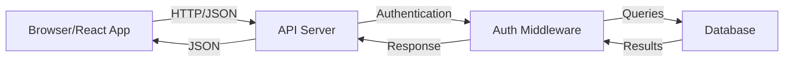
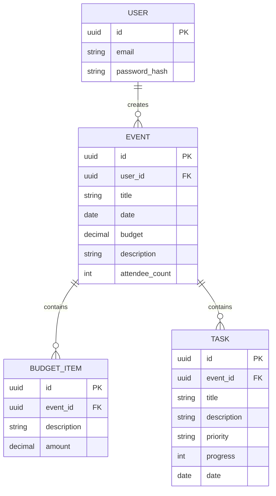

# Design Document: Event Planner

## Overview

The Event Planner is a full-stack web application that provides users with comprehensive event management capabilities. The system enables authenticated users to create events, track budgets with line-item expenses, and manage tasks associated with each event. The application follows a client-server architecture with a React-based frontend and a backend API that handles business logic and data persistence.

The core value proposition is providing users with a unified interface to manage all aspects of event planning - from initial creation through budget tracking and task completion. The system emphasizes data privacy by ensuring users can only access their own events and associated data.

## Architecture

The system follows a three-tier architecture:

### Frontend Layer
- React-based single-page application (SPA)
- Component-based UI with reusable elements
- Client-side routing for navigation between dashboard and event details
- Form validation and user feedback mechanisms
- State management for user session and event data

### Backend Layer
- RESTful API server handling HTTP requests
- Authentication middleware for securing endpoints
- Business logic for event, budget, and task operations
- Input validation and sanitization
- Database abstraction layer

### Data Layer
- Relational database (PostgreSQL or similar)
- Schema supporting users, events, budget items, and tasks
- Foreign key relationships ensuring data integrity
- Indexes on frequently queried fields (user_id, event_id)

### Communication Flow



## Components and Interfaces

### Frontend Components

#### Dashboard Component
- Displays list of user's events
- Provides event creation button
- Shows summary information for each event (title, date, attendee count)
- Handles navigation to event detail views

**Interface:**
```typescript
interface DashboardProps {
  userId: string;
}

interface EventSummary {
  id: string;
  title: string;
  date: Date;
  attendeeCount: number;
}
```

#### EventForm Component
- Collects event details from user input
- Validates input fields client-side
- Submits event data to backend API
- Displays validation errors

**Interface:**
```typescript
interface EventFormProps {
  onSubmit: (event: EventData) => Promise<void>;
  onCancel: () => void;
}

interface EventData {
  title: string;        // max 200 chars
  date: Date;           // not in past
  budget: number;       // positive decimal
  description: string;  // max 2000 chars
  attendeeCount: number; // positive integer
}
```

#### BudgetTracker Component
- Displays list of budget items
- Provides form to add new budget items
- Calculates and displays total spent
- Shows budget comparison (remaining/overage)
- Displays percentage of budget used

**Interface:**
```typescript
interface BudgetTrackerProps {
  eventId: string;
  eventBudget: number;
}

interface BudgetItem {
  id: string;
  description: string;
  amount: number; // positive decimal
}

interface BudgetSummary {
  totalSpent: number;
  budgetRemaining: number;
  percentageUsed: number;
  isOverBudget: boolean;
}
```

#### TaskManager Component
- Displays list of tasks with all attributes
- Provides form to create new tasks
- Supports sorting by priority and date
- Supports filtering by progress status

**Interface:**
```typescript
interface TaskManagerProps {
  eventId: string;
}

interface Task {
  id: string;
  title: string;          // max 200 chars
  description: string;    // max 1000 chars
  priority: 'Low' | 'Medium' | 'High';
  progress: number;       // 0-100
  date: Date;
}

interface TaskFilters {
  sortBy: 'priority' | 'date';
  progressFilter?: 'incomplete' | 'in-progress' | 'complete';
}
```

### Backend API Endpoints

#### Authentication Endpoints
- `POST /api/auth/login` - Authenticate user
- `POST /api/auth/logout` - End user session
- `GET /api/auth/session` - Verify current session

#### Event Endpoints
- `GET /api/events` - Retrieve all events for authenticated user
- `POST /api/events` - Create new event
- `GET /api/events/:id` - Retrieve specific event details
- Authorization: All endpoints verify event ownership

#### Budget Endpoints
- `GET /api/events/:eventId/budget-items` - Retrieve budget items for event
- `POST /api/events/:eventId/budget-items` - Add budget item to event

#### Task Endpoints
- `GET /api/events/:eventId/tasks` - Retrieve tasks for event
- `POST /api/events/:eventId/tasks` - Create task for event

### API Request/Response Formats

**Create Event Request:**
```json
{
  "title": "string",
  "date": "ISO8601 date string",
  "budget": "number",
  "description": "string",
  "attendeeCount": "number"
}
```

**Create Event Response:**
```json
{
  "id": "string",
  "userId": "string",
  "title": "string",
  "date": "ISO8601 date string",
  "budget": "number",
  "description": "string",
  "attendeeCount": "number",
  "createdAt": "ISO8601 timestamp"
}
```

**Error Response:**
```json
{
  "error": "string",
  "validationErrors": [
    {
      "field": "string",
      "message": "string"
    }
  ]
}
```

## Data Models

### User Model
```typescript
interface User {
  id: string;           // UUID primary key
  email: string;        // unique, indexed
  passwordHash: string; // bcrypt hash
  createdAt: Date;
  updatedAt: Date;
}
```

**Database Schema:**
```sql
CREATE TABLE users (
  id UUID PRIMARY KEY DEFAULT gen_random_uuid(),
  email VARCHAR(255) UNIQUE NOT NULL,
  password_hash VARCHAR(255) NOT NULL,
  created_at TIMESTAMP DEFAULT CURRENT_TIMESTAMP,
  updated_at TIMESTAMP DEFAULT CURRENT_TIMESTAMP
);

CREATE INDEX idx_users_email ON users(email);
```

### Event Model
```typescript
interface Event {
  id: string;           // UUID primary key
  userId: string;       // foreign key to users
  title: string;        // max 200 chars
  date: Date;
  budget: number;       // decimal(10,2)
  description: string;  // max 2000 chars
  attendeeCount: number;
  createdAt: Date;
  updatedAt: Date;
}
```

**Database Schema:**
```sql
CREATE TABLE events (
  id UUID PRIMARY KEY DEFAULT gen_random_uuid(),
  user_id UUID NOT NULL REFERENCES users(id) ON DELETE CASCADE,
  title VARCHAR(200) NOT NULL,
  date DATE NOT NULL,
  budget DECIMAL(10,2) NOT NULL CHECK (budget > 0),
  description TEXT CHECK (LENGTH(description) <= 2000),
  attendee_count INTEGER NOT NULL CHECK (attendee_count > 0),
  created_at TIMESTAMP DEFAULT CURRENT_TIMESTAMP,
  updated_at TIMESTAMP DEFAULT CURRENT_TIMESTAMP
);

CREATE INDEX idx_events_user_id ON events(user_id);
CREATE INDEX idx_events_date ON events(date);
```

### BudgetItem Model
```typescript
interface BudgetItem {
  id: string;           // UUID primary key
  eventId: string;      // foreign key to events
  description: string;
  amount: number;       // decimal(10,2), positive
  createdAt: Date;
}
```

**Database Schema:**
```sql
CREATE TABLE budget_items (
  id UUID PRIMARY KEY DEFAULT gen_random_uuid(),
  event_id UUID NOT NULL REFERENCES events(id) ON DELETE CASCADE,
  description VARCHAR(500) NOT NULL,
  amount DECIMAL(10,2) NOT NULL CHECK (amount > 0),
  created_at TIMESTAMP DEFAULT CURRENT_TIMESTAMP
);

CREATE INDEX idx_budget_items_event_id ON budget_items(event_id);
```

### Task Model
```typescript
interface Task {
  id: string;           // UUID primary key
  eventId: string;      // foreign key to events
  title: string;        // max 200 chars
  description: string;  // max 1000 chars
  priority: 'Low' | 'Medium' | 'High';
  progress: number;     // 0-100
  date: Date;
  createdAt: Date;
  updatedAt: Date;
}
```

**Database Schema:**
```sql
CREATE TABLE tasks (
  id UUID PRIMARY KEY DEFAULT gen_random_uuid(),
  event_id UUID NOT NULL REFERENCES events(id) ON DELETE CASCADE,
  title VARCHAR(200) NOT NULL,
  description TEXT CHECK (LENGTH(description) <= 1000),
  priority VARCHAR(10) NOT NULL CHECK (priority IN ('Low', 'Medium', 'High')),
  progress INTEGER NOT NULL CHECK (progress >= 0 AND progress <= 100),
  date DATE NOT NULL,
  created_at TIMESTAMP DEFAULT CURRENT_TIMESTAMP,
  updated_at TIMESTAMP DEFAULT CURRENT_TIMESTAMP
);

CREATE INDEX idx_tasks_event_id ON tasks(event_id);
CREATE INDEX idx_tasks_priority ON tasks(priority);
CREATE INDEX idx_tasks_date ON tasks(date);
```

### Relationships




## Correctness Properties

*A property is a characteristic or behavior that should hold true across all valid executions of a system-essentially, a formal statement about what the system should do. Properties serve as the bridge between human-readable specifications and machine-verifiable correctness guarantees.*

### Property 1: User Event Ownership and Isolation

*For any* user and any set of events in the system, when that user views their dashboard, the displayed events should be exactly the set of events created by that user and should not include any events created by other users.

**Validates: Requirements 1.1, 3.1, 3.2, 3.3**

### Property 2: Event Display Completeness

*For any* event displayed on the dashboard, the rendered output should contain the event's title, date, and attendee count.

**Validates: Requirements 1.3**

### Property 3: Text Field Length Validation

*For any* text input field with a maximum length constraint (event title: 200, event description: 2000, task title: 200, task description: 1000), strings with length less than or equal to the maximum should be accepted, and strings exceeding the maximum should be rejected with a validation error.

**Validates: Requirements 2.2, 2.5, 6.3, 6.4, 10.4**

### Property 4: Date Validation

*For any* date input field, dates in valid format should be accepted, dates in invalid format should be rejected, and for event dates specifically, dates in the past should be rejected while future dates should be accepted.

**Validates: Requirements 2.3, 6.7, 10.3**

### Property 5: Positive Number Validation

*For any* numeric input field requiring positive values (event budget, attendee count, budget item amount, task progress), positive numbers should be accepted and non-positive numbers should be rejected with a validation error.

**Validates: Requirements 2.4, 2.6, 4.3, 10.2**

### Property 6: Task Progress Range Validation

*For any* task progress input, values in the range [0, 100] should be accepted and values outside this range should be rejected with a validation error.

**Validates: Requirements 6.6**

### Property 7: Task Priority Enum Validation

*For any* task priority input, values from the set {'Low', 'Medium', 'High'} should be accepted and any other values should be rejected with a validation error.

**Validates: Requirements 6.5**

### Property 8: Required Field Validation

*For any* form submission with one or more required fields missing, the system should prevent submission and display specific validation error messages for each missing field.

**Validates: Requirements 2.8, 10.1, 10.5**

### Property 9: Data Persistence Round-Trip

*For any* valid event, budget item, or task created in the system, saving the entity and then retrieving it should return an equivalent entity with all fields preserved.

**Validates: Requirements 2.7, 4.4, 6.8, 8.1, 8.2, 8.3**

### Property 10: User Data Retrieval Completeness

*For any* authenticated user, retrieving their data should return all events, budget items, and tasks associated with that user, with no data missing or belonging to other users.

**Validates: Requirements 8.4**

### Property 11: Budget Total Calculation

*For any* event with a set of budget items, the calculated total spent should equal the sum of all budget item amounts.

**Validates: Requirements 4.5**

### Property 12: Budget Comparison Calculation

*For any* event with a budget and total spent amount, the system should correctly calculate: (1) the difference (budget - total), (2) whether the budget is exceeded (total > budget), (3) the remaining budget when not exceeded (budget - total), (4) the overage when exceeded (total - budget), and (5) the percentage used ((total / budget) * 100).

**Validates: Requirements 5.1, 5.2, 5.3, 5.4**

### Property 13: Task Display Completeness

*For any* task displayed in the task manager, the rendered output should contain all task attributes: title, description, priority, progress, and date.

**Validates: Requirements 7.1**

### Property 14: Task Sorting Correctness

*For any* list of tasks, sorting by priority should result in tasks ordered by priority level (High, Medium, Low), and sorting by date should result in tasks ordered chronologically.

**Validates: Requirements 7.2, 7.3**

### Property 15: Task Filtering Correctness

*For any* list of tasks and a progress status filter (incomplete: 0%, in-progress: 1-99%, complete: 100%), the filtered result should contain only tasks matching the specified progress criteria.

**Validates: Requirements 7.4**

### Property 16: Authentication Required for Data Access

*For any* request to access event data (events, budget items, tasks) without valid authentication, the system should deny access and either redirect to login or return an authentication error.

**Validates: Requirements 9.1, 9.2**

### Property 17: Authentication Success and Failure

*For any* authentication attempt, valid credentials should grant access to the dashboard, and invalid credentials should be rejected with an authentication error message.

**Validates: Requirements 9.3, 9.4**

### Property 18: Budget Item Display Completeness

*For any* event with budget items, viewing the event should display all budget items associated with that event.

**Validates: Requirements 4.1**

### Property 19: Task Display Completeness for Event

*For any* event with tasks, viewing the event should display all tasks associated with that event.

**Validates: Requirements 6.1**

## Error Handling

The system implements comprehensive error handling at multiple layers:

### Frontend Error Handling

**Validation Errors:**
- Client-side validation provides immediate feedback before API calls
- Each form field displays specific error messages when validation fails
- Form submission is disabled when validation errors exist
- Error messages are cleared when user corrects the input

**API Errors:**
- Network failures display user-friendly error messages
- HTTP error responses are parsed and displayed appropriately
- 401/403 errors trigger redirect to login page
- 500 errors display generic "something went wrong" message

**State Management Errors:**
- Failed data fetches are retried with exponential backoff
- Loading states prevent duplicate submissions
- Optimistic updates are rolled back on failure

### Backend Error Handling

**Input Validation:**
- All inputs are validated before processing
- Validation errors return 400 status with detailed field-level errors
- SQL injection prevention through parameterized queries
- XSS prevention through input sanitization

**Authentication/Authorization:**
- Missing or invalid tokens return 401 Unauthorized
- Access to resources owned by other users returns 403 Forbidden
- Session expiration triggers re-authentication flow

**Database Errors:**
- Connection failures are logged and return 503 Service Unavailable
- Constraint violations return 400 with specific error messages
- Transaction rollbacks on any operation failure
- Deadlock detection and retry logic

**Business Logic Errors:**
- Invalid state transitions return 409 Conflict
- Resource not found returns 404
- All errors are logged with request context for debugging

### Error Response Format

All API errors follow a consistent format:

```json
{
  "error": "Human-readable error message",
  "code": "ERROR_CODE",
  "validationErrors": [
    {
      "field": "fieldName",
      "message": "Specific validation error"
    }
  ],
  "timestamp": "ISO8601 timestamp"
}
```

## Testing Strategy

The testing strategy employs a dual approach combining unit tests for specific scenarios and property-based tests for comprehensive coverage of universal properties.

### Property-Based Testing

Property-based testing will be implemented using **fast-check** for JavaScript/TypeScript. Each correctness property defined in this document will be validated through property-based tests that generate random inputs and verify the property holds across all cases.

**Configuration:**
- Minimum 100 iterations per property test
- Each test tagged with format: **Feature: event-planner, Property {number}: {property_text}**
- Custom generators for domain objects (events, budget items, tasks)
- Shrinking enabled to find minimal failing cases

**Property Test Coverage:**
- All 19 correctness properties will have corresponding property-based tests
- Generators will produce valid and invalid inputs to test validation
- Edge cases (empty lists, boundary values, special characters) handled by generators
- Round-trip properties for persistence and serialization

### Unit Testing

Unit tests complement property-based tests by focusing on:

**Specific Examples:**
- Dashboard displays create event button (Requirement 1.2)
- Clicking create button displays event form (Requirement 2.1)
- Budget tracker accepts items with description and amount (Requirement 4.2)
- Budget tracker displays total alongside budget (Requirement 4.6)
- Task manager accepts all required fields (Requirement 6.2)
- Unauthenticated access redirects to login (Requirement 9.2)

**Integration Points:**
- API endpoint integration tests
- Database query correctness
- Authentication middleware behavior
- Component interaction flows

**Edge Cases:**
- Empty event lists
- Zero budget items
- Tasks with 0% and 100% progress
- Boundary values for length constraints
- Special characters in text fields

**Error Conditions:**
- Network failures
- Database connection errors
- Invalid authentication tokens
- Malformed request payloads

### Testing Tools and Frameworks

**Frontend:**
- Jest for unit testing
- React Testing Library for component tests
- fast-check for property-based tests
- MSW (Mock Service Worker) for API mocking

**Backend:**
- Jest for unit testing
- Supertest for API endpoint tests
- fast-check for property-based tests
- In-memory database for integration tests

**End-to-End:**
- Playwright for critical user flows
- Focus on authentication, event creation, and budget tracking flows

### Test Organization

```
tests/
├── unit/
│   ├── components/
│   ├── api/
│   └── utils/
├── integration/
│   ├── api-endpoints/
│   └── database/
├── property/
│   ├── validation.properties.test.ts
│   ├── persistence.properties.test.ts
│   ├── calculations.properties.test.ts
│   ├── authorization.properties.test.ts
│   └── generators/
│       ├── event.generator.ts
│       ├── budget.generator.ts
│       └── task.generator.ts
└── e2e/
    ├── auth.spec.ts
    ├── event-creation.spec.ts
    └── budget-tracking.spec.ts
```

### Coverage Goals

- Unit test coverage: 80% minimum
- Property-based tests: 100% of correctness properties
- Integration tests: All API endpoints
- E2E tests: Critical user journeys

### Continuous Integration

- All tests run on every pull request
- Property-based tests run with increased iterations (1000) in CI
- Failed property tests report minimal failing example
- Coverage reports generated and tracked over time
